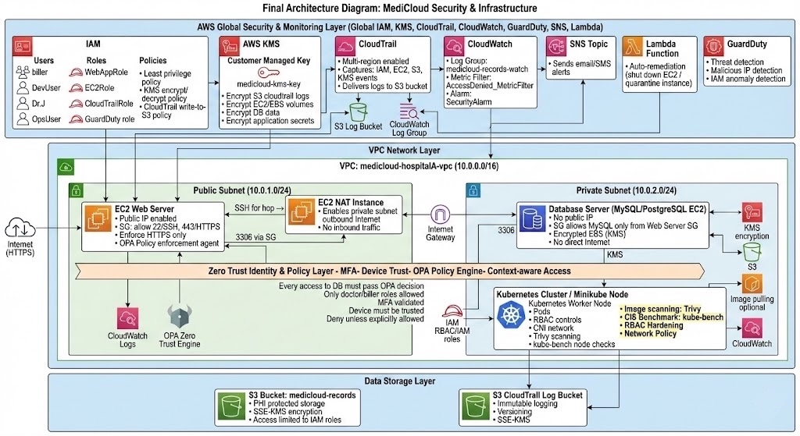

 MediCloud Security Architecture

A comprehensive AWS cloud security portfolio demonstrating HIPAA-compliant healthcare data protection across identity management, encryption, network isolation, threat detection, and zero-trust access control.

**Live Demo:** Built with Vite + vanilla JS | [Run locally](#getting-started)

---

## Architecture Overview



MediCloud is a simulated healthcare cloud platform (Hospital A) built on AWS, implementing defense-in-depth security across multiple layers:

| Layer | AWS Services | Purpose |
|-------|-------------|---------|
| **Identity & Access** | IAM, OPA Rego | 4 IAM roles (Doctor, Biller, DevUser, OpsUser) with least-privilege policies |
| **Data Protection** | KMS | Customer-managed encryption keys with role-based crypto permissions |
| **Network Security** | VPC, Security Groups | Public/private subnet isolation, NAT instance, Kubernetes hardening |
| **Threat Response** | GuardDuty, EventBridge, Lambda, SNS, S3 | Automated detection-to-remediation pipeline |
| **Monitoring & Audit** | CloudTrail, CloudWatch | Multi-region API logging, metric filters, real-time alerting |
| **Zero Trust** | OPA Rego Policy Engine | Context-aware access decisions based on MFA, device trust, geolocation |

## Key Features

### Interactive Demos
- **Threat Detection Simulator** — Animated pipeline visualization: adjust severity, watch GuardDuty findings flow through EventBridge → SNS → Lambda → S3 with real-time event log
- **Zero Trust Playground** — Toggle 9 security conditions (MFA, VPN, device compliance, geolocation) with live risk scoring and ALLOW/DENY decisions based on OPA Rego policy

### Security Implementations
- **4 IAM Roles** with explicit Deny policies, Condition keys, and separation of duties
- **KMS Key Policy** with role-based crypto permissions and key deletion protection
- **VPC Architecture** with public/private subnets, NAT instance, and locked-down security groups
- **Lambda Auto-Remediation** triggered by GuardDuty findings via EventBridge
- **CloudTrail + CloudWatch** pipeline with AccessDenied metric filters and alarm thresholds
- **Hardened Kubernetes** deployment with Pod Security Standards, RBAC, NetworkPolicy, non-root containers

## Tech Stack

| Category | Technology |
|----------|-----------|
| Build | Vite |
| Frontend | Vanilla JS (ES Modules) |
| Styling | Tailwind CSS (PostCSS) |
| Animations | anime.js |
| Charts | ECharts (radar chart) |
| Typing Effect | Typed.js |
| Syntax Highlighting | Prism.js |
| Routing | Custom hash-based SPA router |

## Getting Started

```bash
# Install dependencies
npm install

# Start dev server
npm run dev
# → http://localhost:5173

# Production build
npm run build
# → Output in dist/
```

## Project Structure

```
src/
├── main.js                 # App entry, route registration
├── router.js               # Hash-based SPA router
├── style.css               # Tailwind + custom animations
├── components/
│   ├── Navbar.js           # Navigation with mobile hamburger menu
│   ├── Footer.js           # Site footer
│   ├── Modal.js            # Reusable modal overlay system
│   ├── CodeBlock.js        # Prism.js syntax highlighting
│   └── RiskGauge.js        # SVG semicircle risk gauge
├── pages/
│   ├── Home.js             # Landing page, architecture diagrams, quiz
│   ├── Identity.js         # 4 IAM roles, policy comparison, simulator
│   ├── Encryption.js       # KMS key policy, permission matrix
│   ├── Network.js          # VPC diagram, security groups, K8s manifest
│   ├── ThreatResponse.js   # Pipeline overview, Lambda code, evidence
│   ├── ThreatSimulator.js  # Interactive threat detection simulator
│   ├── Monitoring.js       # CloudTrail & CloudWatch configuration
│   └── ZeroTrustPlayground.js  # OPA Rego policy playground
├── data/
│   ├── modules.js          # Pillar definitions, stats, color map
│   ├── policies.js         # IAM & KMS policy JSON strings
│   ├── lambda-code.js      # Auto-remediation Lambda (Python)
│   ├── rego-policy.js      # OPA Rego zero-trust policy
│   ├── k8s-manifest.js     # Hardened Kubernetes YAML
│   └── quiz-questions.js   # Security assessment questions
└── utils/
    └── animate.js          # Scroll-triggered animations
```

## Course Context

Built as the final project for **CYBER 290: Cloud Security** — demonstrating hands-on implementation of AWS security services for a healthcare scenario requiring HIPAA compliance.

**Author:** Yining Liu
